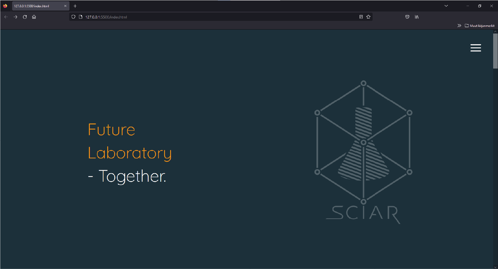
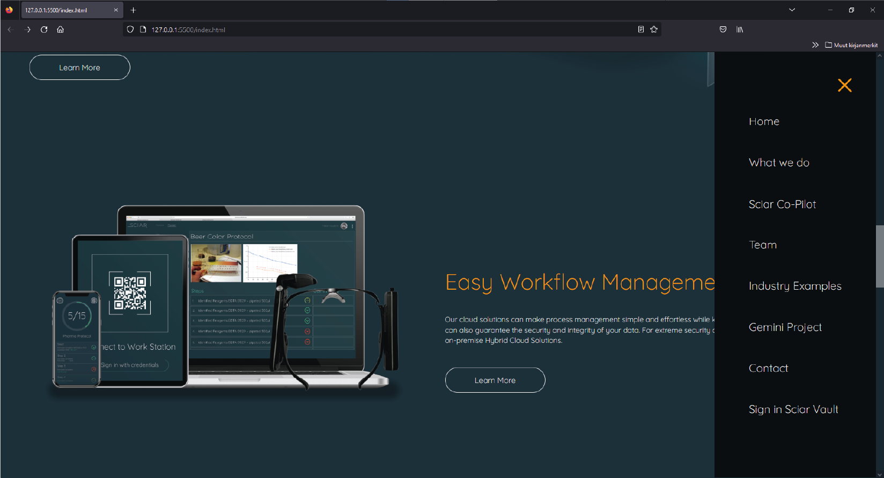
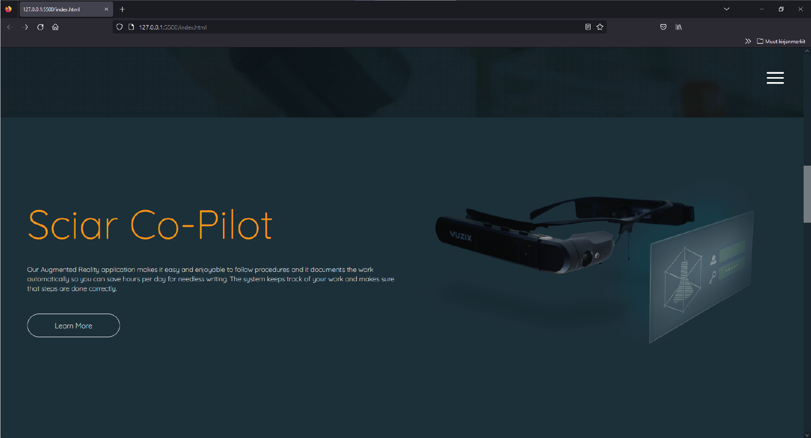
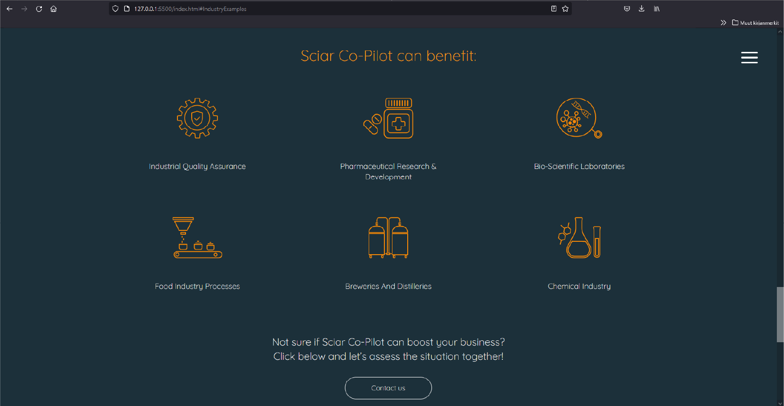

<h1 align="center">
   
    Sciar Company Ltd Website
   
</h1>

 
  </img>
  </img>
  </img>
  </img>

## Frontend for A life science startup company.

* I've built and designed this frontend using regular html, javascript and css without using any external libraries. 
* I've built the backend for this project using Python Django, and deployed it to Amazon Web Services.
* The design assets are either produced by me or by our team members under my direction.

## Other details:

To save time I've taken the files for the frontend from the original Django project. Few links might be out of use because of this. The framework is really robust and the website is really simple, only needing backend in it's email form. The project on it's current state is only a demonstration of the overall design and functionality of the site.

